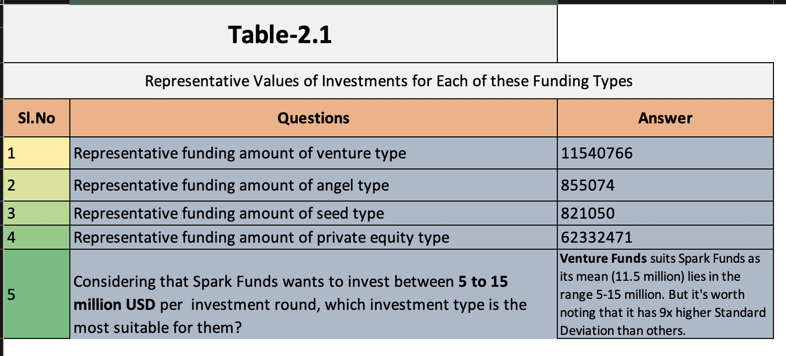
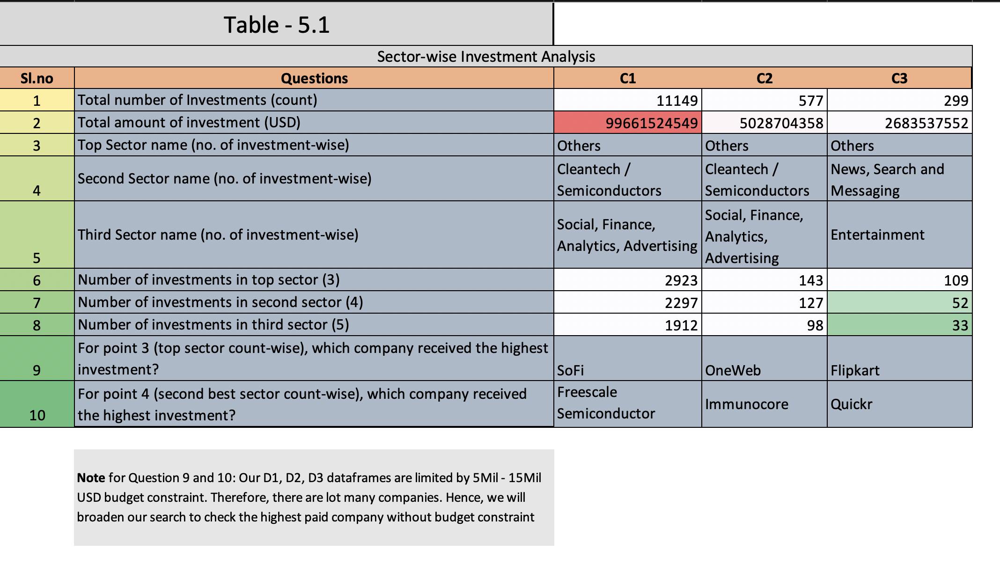

# Investment-Analysis-Spark-Funds
Investment Analysis Assignment done as a course requisite for PG Certification course in Machine Learning and Deep Learning


## Objectives

**Note: This is an individual assignment.**

# Project Brief

You work for Spark Funds, an asset management company. Spark Funds wants to make
investments in a few companies. The CEO of Spark Funds wants to understand the global
trends in investments so that she can take the investment decisions effectively.

# Business and Data Understanding

Spark Funds has two minor constraints for investments:

1. It wants to invest between **5 to 15 million USD** per round of investment
2. It wants to invest only in **English-speaking countries** because of the ease of
    communication with the companies it would invest in
- For your analysis, consider a country to be English speaking only if English is one of
    the official languages in that country
- You may use this list: Click here for a list of countries where English is an official
    language.

These conditions will give you sufficient information for your initial analysis. Before getting
to specific questions, let’s understand the problem and the data first.

**1. What is the strategy?**

Spark Funds wants to invest where most **other investors are investing**. This pattern is often
observed among early stage startup investors.


**2. Where did we get the data from?**

We have taken real investment data from **crunchbase.com** , so the insights you get may be
incredibly useful. For this assignment, we have divided the data into the following files:

You have to use three main data tables for the entire analysis ( **available for download on the
next page** ):

**3. What is Spark Funds’ business objective?**

The business objectives and goals of data analysis are pretty straightforward.

1. **Business objective:** The objective is to identify the best sectors, countries, and a
    suitable investment type for making investments. The overall strategy is to invest where
    others are investing, implying that the 'best' sectors and countries are the ones 'where
    most investors are investing'.
2. **Goals of data analysis** : Your goals are divided into three sub-goals:
    o **Investment type analysis** : Comparing the typical investment amounts in the
       venture, seed, angel, private equity etc. so that Spark Funds can choose the type
       that is best suited for their strategy.
    o **Country analysis** : Identifying the countries which have been the most heavily
       invested in the past. These will be Spark Funds’ favourites as well.
    o **Sector analysis** : Understanding the distribution of investments across the eight
       main sectors. (Note that we are interested in the eight 'main sectors' provided in
       the **mapping file**. The two files — **companies and rounds2** — have numerous


```
sub-sector names; hence, you will need to map each sub-sector to its main
sector.)
```
**4. How do you approach the assignment? What are the deliverables?**

The entire assignment is divided into checkpoints to help you navigate. For each checkpoint,
you are advised to fill in the tables into the spreadsheet provided in the download segment. The
tables are also mentioned under the **'Results Expected'** section after each checkpoint. Since
this is the first assignment, you have been provided with some additional guidance. Going
forward you will be expected to structure and solve the problem by yourself, just like you
would be solving problems in real life scenarios.





